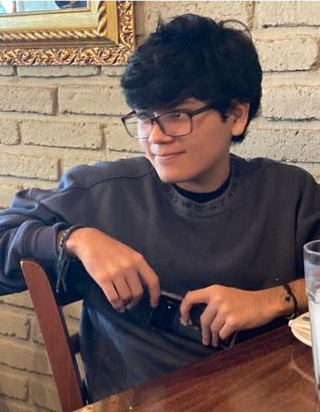

<p align = "center">
  
</p>
<p align = "center">
  
</p>

<div align="center">


<details>
<summary>Open profile</summary>

<br>
<div>
  <div align=center>
      
  </div>
  <div align=center>
      <a>Game Developer Mexican</a>
  </div>
</div>

<details>
<summary>About me</summary>

[//]: # (You must have a lf before the markdown element when inside a block for it to work: https://stackoverflow.com/questions/29368902/how-can-i-wrap-my-markdown-in-an-html-div)

<div align="left">

```js
/**
 * Represents me.
 *
 * @constructor
 * @param {string} location - Guadalajara, Jalisco, México
 * @param {string} languagues - English, Spanish.
 * @param {string} jobTitle - Software and Game Engineer.
 * @param {string} specialization - Game Developer with C#.
 * @param {string} interests - Game System, ML-Agents, Unity and UE.
 * @param {string} hobbies - Gaming, music, series and movies.
 * @param {string} education - University, interactive software and video game development.
 * @param {string} approachable - Yes, to collaborate on exciting projects, don't hesitate to write out.
 *
 * @throws {Punch} To any and all bugs.
 *
 * @returns {Object} JP.
 */
```

</div>

</details>

<details>
<summary>Tools</summary>
<div>
  <p style="display: inline-block;" align="center">
    <kbd>
      <kbd>Programming Languages</kbd>
      <br>
      <br>
       
      
      
      
    </kbd>
    <kbd>
      <kbd>Front-end</kbd>
      <br>
      <br>
       
        
      
    </kbd>
    <br>
    <br>
    <kbd>
      <kbd>Operating System</kbd>
      <br>
      <br>
      
    </kbd>
    <kbd>
      <kbd>Tools</kbd>
      <br>
      <br>
      
      
      
      
      
      

  </kbd>
     <kbd>
      <kbd>Game Development</kbd>
      <br>
      <br>
      
      
      
    </kbd>
  </p>
</div>
</details>

<details>
  <summary>GitHub Stats</summary>
  <br>
  <p align="center">
    
  </p>
</details>

<details>
  <summary>Quote</summary>
  <br>
  <blockquote>
    Quote here
    <br><strong>Book/X - Person</strong>
  </blockquote>
</details>

<details>
  <summary>Free DOSE hit</summary>
  <br>
  <small><i>DOSE (dopamine, oxytocin, serotonin & endorphin), refresh page if dose was ineffective.</i></small>
  <br>
  <div align="center"></div>
</details>

<details>
<summary>What can I do for you?</summary>
<table style="border: none">
  <tr>
  <td width="50%" valign="top">

[//]: # (Fighting against markdown and blocks isn't easy, indentation is catastrophic)

## Let's Work on Your Project Together!


If you have any questions about me, if you like my profile or if you would like to ask me something, <a href="https://www.linkedin.com/in/juan-pablo-saavedra-ram%C3%ADrez-77ab15288/">contact me</a>, and I will respond as quickly as possible.

  </td>
  <td width="50%" valign="top">

## It's not perfect, isn't it?

****

<blockquote>“I think it’s very important to have a feedback loop, where you’re constantly thinking about what you’ve done and how you could be doing it better.”
<br><strong>– Elon Musk</strong></blockquote>

  </td>
  </tr>
</table>
</details>

</details>


</div>

<div align=center>
 <a href="https://www.linkedin.com/in/juan-pablo-saavedra-ram%C3%ADrez-77ab15288/" target="_blank"></a>

<a href="mailto:saavedra75@live.com?subject=Hi%20Kartik%20,%20nice%20to%20meet%20you!" target="_blank"></a>

<a href="https://juan-pablo-sr.itch.io/" target="_blank"></a>

</div>

------
Credit: [10Kartik](https://github.com/10Kartik)

Last Edited on: 18/01/2024